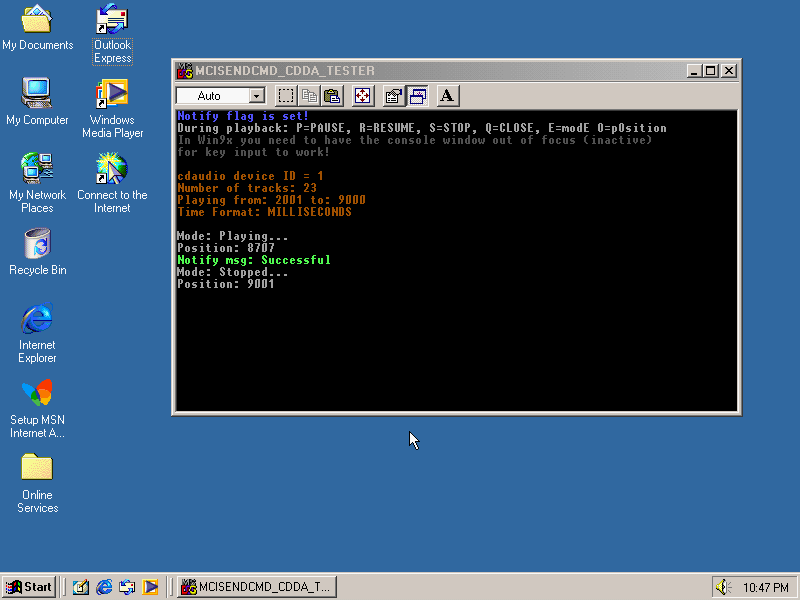

# mciSendCmd-CDDA-tester

1.1:
Added query for:
- MCI_STATUS_LENGTH
- MCI_STATUS_LENGTH -> MCI_TRACK
- MCI_STATUS_POSITION -> MCI_TRACK

A preliminary and very simple mci command tester/player for mci cdaudio device. (Still missing a lot of commands but the most basic ones are implemented.) It is useful for analyzing how the mcicda device works on Win9x/XP vs. Vista+ and for developing cdda emulation. In theory it should run on any Windows version from Win9x - Win10(and 11?)...

Most notable differences between win9x/XP and Vista and newer:
- mode does not update when playback finishes on Vista+.
- notify success message is not sent on Vista+.
- MCI_STOP works as a pause in Win9x/XP but resets to beginning of track on Vista+.

For legacy OS testing on modern systems you need a system emulator that supports the cdaudio device. For example PCem + Win9x is a good test bed. The program compiles as Win9x compatible using mingw v6.3.0-1. Newer flavors like mingw-w64 do not seem to produce binaries that can run on win9x.

